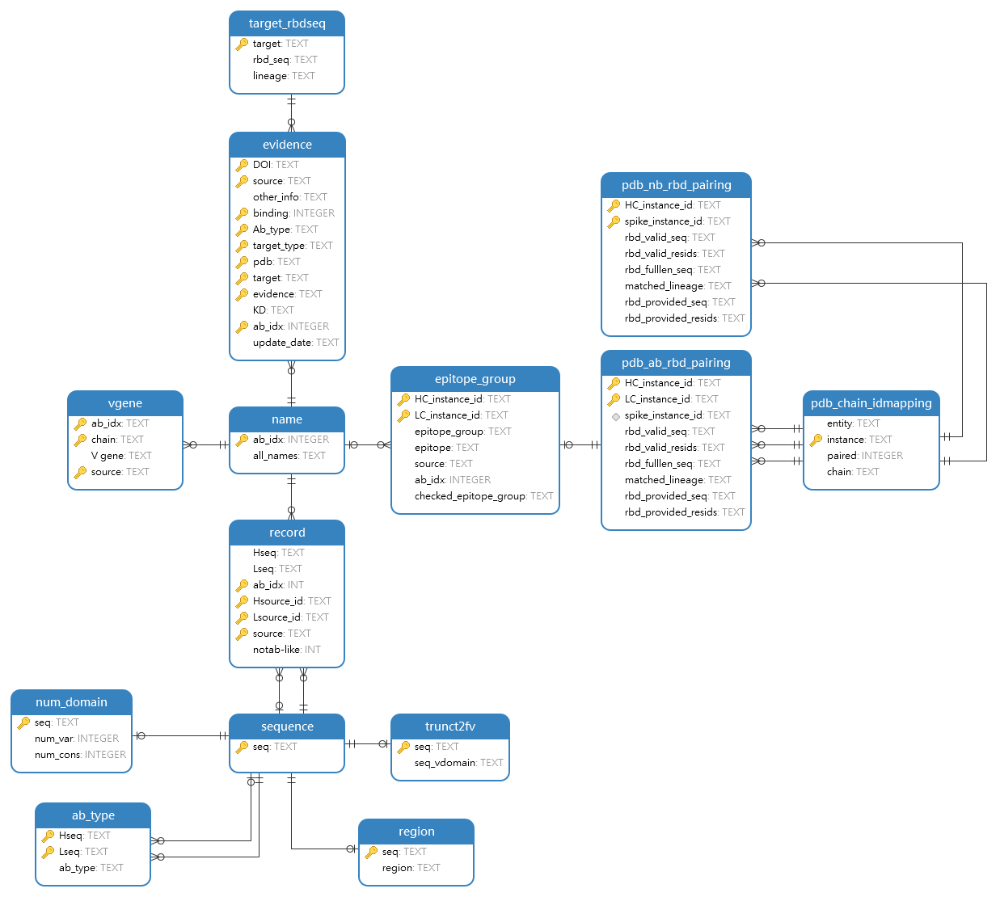

<!--  -->

<!-- change introduction according to selected -->

<!-- change dllink according to selected -->

# One click for all {#download-all}
Just click <a href="../compressed/all_db_tables.7z" download="all_db_tables.7z">here</a> to download all the tables in the database and <a href="../compressed/all_ds_tables.7z" download="all_ds_tables.7z">here</a> for all the processed datasets.

# Or select one table to preview and download {#download-one}
Please choose a table firstly: 
<select name="table2dl" id="table-select">
  <option value="name" selected>name</option>
  <option value="evidence">evidence</option>
  <option value="sequence">sequence</option>
  <option value="record">record</option>
  <option value="region">region</option>
  <option value="num_domain">num_domain</option>
  <option value="ab_type">ab_type</option>
  <option value="trunct2fv">trunct2fv</option>
  <option value="pdb_chain_idmapping">pdb_chain_idmapping</option>
  <option value="pdb_ab_rbd_pairing">pdb_ab_rbd_pairing</option>
  <option value="pdb_nb_rbd_pairing">pdb_nb_rbd_pairing</option>
  <option value="epitope_group">epitope_group</option>
  <option value="target_rbdseq">target_rbdseq</option>
  <option value="vgene">vgene</option>
</select>
<a id="dbtable-dllink" href="../_data/tables/name.csv" download="name.csv" class="btn btn--primary">Download</a>

<h2 id="header-introduction">Introduction</h2>

<h2 id="header-preview">Preview</h2>

Number of rows to show: 
<select name="preview-numrow" id="numrow-select">
  <option selected>10</option>
  <option >20</option>
  <option >50</option>
</select>
<a href="#preview" class="btn btn--primary" id="preview-button">Apply</a>

<table id="table-preview">
<thead id="table-preview-header"></thead>
<tbody id="table-preview-body"></tbody>
</table>

